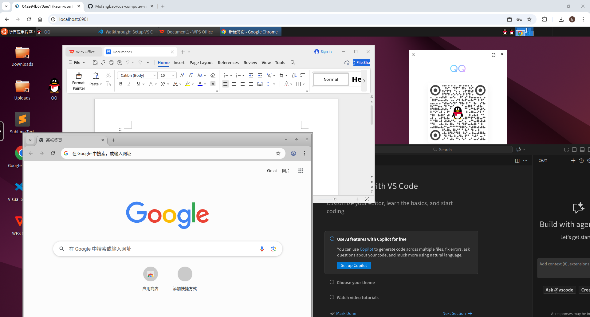

# CUA Docker 容器

中文文档 | [English](README_en.md)

一个为计算机使用代理（CUA）设计的容器化虚拟桌面环境，具有中文本地化和预装应用程序。



## 概述

此 Docker 容器基于 [CUA Kasm Ubuntu 容器](https://github.com/trycua/cua/tree/main/libs/kasm)，提供完整的 Ubuntu 24.04 (Noble) 桌面环境和 XFCE，专为中国用户和计算机自动化任务优化。

## 特性

- **Ubuntu 24.04 (Noble)** 配备 XFCE 桌面环境
- **中文本地化**：完整的中文语言支持和时区设置（亚洲/上海）
- **CUA 计算机服务器**：预装用于通过 REST API 进行远程计算机控制
- **VNC 访问**：通过 noVNC 提供基于 Web 的桌面界面
- **应用程序**：
  - WPS Office
  - QQ
  - VSCode
  - Chrome

## 快速开始

### 构建容器

如果需要自定义或在其他平台使用，可以从源码构建：

```bash
docker build -t cua-computer-server-noble:latest .
```
### 运行容器
对于 AMD64 平台用户，可以直接使用预编译的镜像：
**预编译镜像地址**：https://hub.docker.com/r/ppagent/cua-computer-server-noble
```bash
docker run -d \
  --name kasm-noble-desktop \
  -p 6901:6901 \
  -p 8000:8000 \
  -e VNC_PW=123456 \
  --shm-size=4g \
  cua-computer-server-noble:latest
```

### 访问容器

- **VNC 桌面**：在浏览器中打开 http://localhost:6901
- **计算机服务器 API**：可通过 http://localhost:8000 访问
- **VNC 密码**：123456

## 容器配置

### 端口

- `6901`：VNC Web 界面（noVNC）
- `8000`：CUA 计算机服务器 API 端点

### 环境变量

- `VNC_PW`：VNC 密码（推荐设置为 "123456"）
- `DISPLAY`：X11 显示（设置为 ":0"）
- `LANG`：系统语言（设置为 "zh_CN.UTF-8"）
- `TZ`：时区（设置为 "Asia/Shanghai"）

### 卷挂载

- `/home/kasm-user/Desktop`：桌面文件和快捷方式
- `/home/kasm-user/storage`：持久存储挂载点
- `/home/kasm-user/shared`：共享文件夹挂载点

### 默认用户

- **VNC 登录用户名**：`kasm_user`
- **VNC 登录密码**：通过环境变量 `VNC_PW` 设置（如：123456）
- **Sudo 权限**：该用户具有完整的 sudo 权限，无需密码验证

## CUA 计算机服务器 API

容器包含 CUA 计算机服务器，提供用于远程计算机控制的 REST API。详细的 API 文档请访问：

**📖 [CUA 计算机服务器 REST API 文档](https://docs.cua.ai/docs/libraries/computer-server/REST-API)**

```

## 原始项目

此 Dockerfile 基于原始的 [CUA Kasm Ubuntu 容器](https://github.com/trycua/cua/tree/main/libs/kasm) 进行修改。