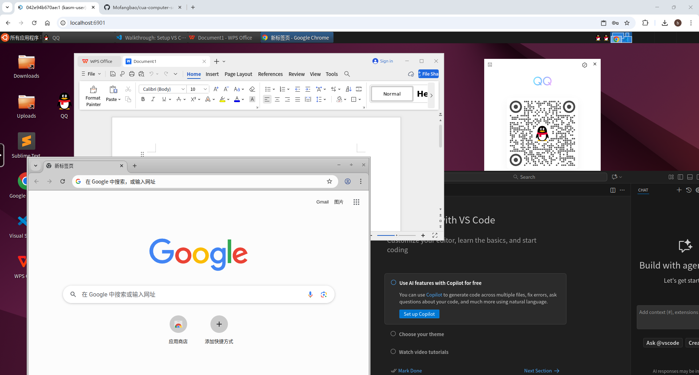

# CUA Docker Container

[中文文档](README.md) | English

A containerized virtual desktop environment for Computer-Using Agents (CUA) with Chinese localization and pre-installed applications.



## Overview

This Docker container is based on the [CUA Kasm Ubuntu container](https://github.com/trycua/cua/tree/main/libs/kasm) and provides a complete Ubuntu 24.04 (Noble) desktop environment with XFCE, optimized for Chinese users and computer automation tasks.

## Features

- **Ubuntu 24.04 (Noble)** with XFCE desktop environment
- **CUA Computer Server**: Pre-installed for remote computer control via REST API
- **VNC Access**: Web-based desktop interface through noVNC
- **Applications**:
  - WPS Office (Chinese office suite)
  - QQ (Chinese instant messaging)
  - VSCode
  - Chrome
- **Development Tools**:
  - Python with pip
  - Screen capture tools (gnome-screenshot, wmctrl, ffmpeg)
  - Clipboard utilities (xclip, socat)

## Quick Start

### Build the Container

If you need customization or use on other platforms, you can build from source:

```bash
docker build -t cua-computer-server-noble:latest .
```

### Run the Container
For AMD64 platform users, you can directly use the pre-built image:
**Pre-built Image**: https://hub.docker.com/r/ppagent/cua-computer-server-noble

```bash
docker run -d \
  --name kasm-noble-desktop \
  -p 6901:6901 \
  -p 8000:8000 \
  -e VNC_PW=123456 \
  --shm-size=4g \
  cua-computer-server-noble:latest
```

### Access the Container

- **VNC Desktop**: Open http://localhost:6901 in your browser
- **VNC Login Username**: `kasm_user`
- **VNC Login Password**: Set via `VNC_PW` environment variable (eg: 123456)
- **Sudo Access**: This user has full sudo privileges without password authentication
- **Computer Server API**: Available at http://localhost:8000

## Container Configuration

### Ports

- `6901`: VNC web interface (noVNC)
- `8000`: CUA Computer Server API endpoint

### Environment Variables

- `VNC_PW`: VNC password (recommended: "123456")
- `DISPLAY`: X11 display (set to ":0")
- `LANG`: System language (set to "zh_CN.UTF-8")
- `TZ`: Timezone (set to "Asia/Shanghai")

### Default User


## CUA Computer Server API

The container includes the CUA Computer Server which provides a REST API for remote computer control. For detailed API documentation, visit:

**📖 [CUA Computer Server REST API Documentation](https://docs.cua.ai/docs/libraries/computer-server/REST-API)**

## Based On

This Dockerfile is modified from the original [CUA Kasm Ubuntu container](https://github.com/trycua/cua/tree/main/libs/kasm)